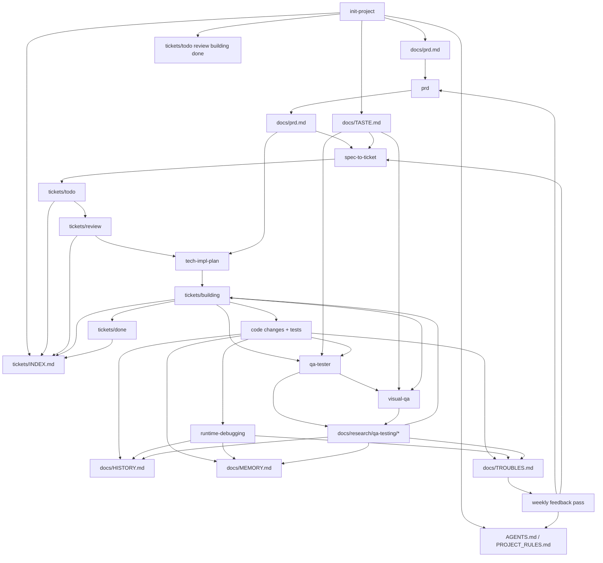

# System

This repo is a skill system, not just a pile of prompts.

<!--
System overview only.
Keep this file human-readable and broad.
Execution-time agents should rely on AGENTS.md plus the active ticket.
-->

## System Map

## Core Flow

1. `init-project`
   - bootstrap project docs, rules, shared taste, and filesystem ticket board
   - outputs: `AGENTS.md`, `PROJECT_RULES.md`, `docs/*`, `tickets/*`
2. `prd`
   - clarify requirements and first SLC slice
   - output: `docs/prd.md`
3. `spec-to-ticket`
   - convert one slice into executable raw tickets
   - output: `tickets/todo/*`
4. `tech-impl-plan`
   - refine one ticket in `tickets/review/` until it is approval-ready
   - output: updated ticket file + plan in chat or markdown
5. build
   - implement the approved ticket from `tickets/building/`
   - output: code + tests + ticket updates
6. `qa-tester` + `visual-qa`
   - verify behavior and UI against the ticket contract
   - output: QA artifacts under `docs/research/qa-testing/` plus links back into the ticket
7. memory + history
   - log durable rules and notable changes
   - outputs: `docs/HISTORY.md`, `docs/MEMORY.md`
8. troubles feedback
   - log repeated misses, user corrections, and preventable failures
   - outputs: `docs/TROUBLES.md`, then periodic promotion back into `AGENTS.md` and skills

## Source Of Truth

- Repo contract: [AGENTS.md](/home/kenjipcx/.cursor/AGENTS.md)
- Project taste: [docs/TASTE.md](/home/kenjipcx/.cursor/docs/TASTE.md)
- Requirements: [docs/prd.md](/home/kenjipcx/.cursor/docs/prd.md)
- Specs: `docs/specs/*`
- Ticket board: [tickets/README.md](/home/kenjipcx/.cursor/tickets/README.md)
- Board index: [tickets/INDEX.md](/home/kenjipcx/.cursor/tickets/INDEX.md)
- Active work: `tickets/review/*` and `tickets/building/*`
- Durable rules: [docs/MEMORY.md](/home/kenjipcx/.cursor/docs/MEMORY.md)
- Change log: [docs/HISTORY.md](/home/kenjipcx/.cursor/docs/HISTORY.md)
- Failure log: [docs/TROUBLES.md](/home/kenjipcx/.cursor/docs/TROUBLES.md)

## Skill Roles

- `init-project`: scaffold the operating system
- `prd`: turn fuzzy goals into product truth
- `spec-to-ticket`: turn product truth into ticket truth
- `tech-impl-plan`: plan one commit-sized change
- `runtime-debugging`: handle unclear repro/runtime issues
- `visual-qa`: do ticket-first, taste-aware UI comparison
- `qa-tester`: execute QA and produce evidence
- `code-review`: final quality sweep

## Routing

- unclear feature request -> `prd`
- accepted PRD, need slice -> `spec-to-ticket`
- picked ticket needs planning/approval -> `tech-impl-plan` in `tickets/review/`
- building user-visible UI -> `qa-tester` and `visual-qa`
- repro bug with unclear cause -> `runtime-debugging`
- final quality pass -> `code-review`

## Ticket Contract

<!--
Ticket shape is intentionally centralized in tickets/templates/ticket.md.
README should explain the role of the ticket, not duplicate mutable field lists.
-->

Follow the canonical ticket shape in [tickets/templates/ticket.md](/home/kenjipcx/.cursor/tickets/templates/ticket.md).

In practice:

- UI-bearing tickets carry a compact `Agent Contract`
- tickets carry minimal status/control fields for board movement
- tickets end with a compact `User Evidence` packet for human review

Planning, build, and QA should all work from that one ticket file instead of restating ticket structure elsewhere.

## Design Doctrine

Shared UI doctrine lives in [docs/TASTE.md](/home/kenjipcx/.cursor/docs/TASTE.md).

Tickets should reference taste briefly, not restate long style prose.
QA should restate taste before judging screens.

## Boundary

<!--
These boundaries matter because the same concepts appear across docs, skills, and agents.
If this separation drifts, prompts get noisy and agents reload too much context.
-->

- `AGENTS.md` = contract and guardrails
- skills = workflow logic
- agents = execution roles
- `docs/*` = project state and memory
- `docs/TROUBLES.md` = raw failure feedback loop for future system tuning
- `tickets/*` = execution board and ticket source of truth

If those drift apart, the system gets noisy fast.
